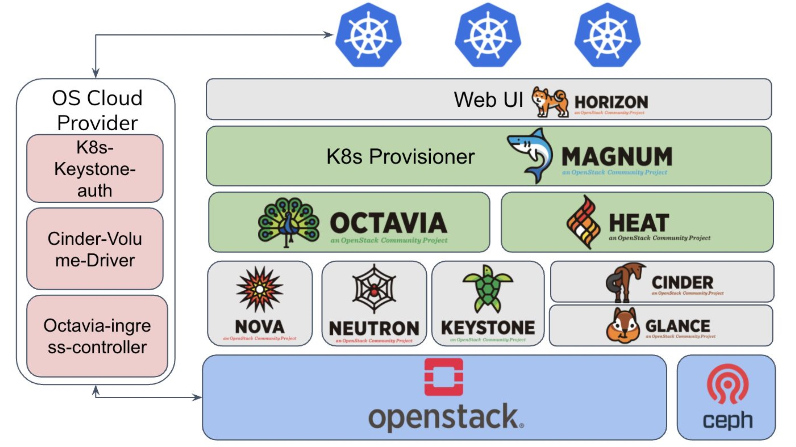

# Linaro Developer Cloud Kubernetes service

## General
Linaro Developer Cloud is a pure open source cloud running on Arm64 servers. We have a cluster running by OpenStack, and
the Kubernetes as a service is setup by OpenStack Magnum project now. All the cluster are running on the Arm64, which
can offer you production level Kubernetes service on Arm64 platform.

## Architecture

## Support Version
Kubernetes v1.17.1 with Calico/Flannel network. Current we offer the virtual machine based Kubernetes, the vm based
operation system is was Fedora Coreos aarch64 dev version, which was built by Linaro LDCG cloud infra team.

## Service ingress
Linaro Developer Cloud offers the capability for users to deploy the apps on the Kubernetes and make it accessed from
outside by OpenStack Load balance service - Octavia. To achieve this, users need to setup the Octavia ingress controller,
the document to address this will come soon.

## Application
Please come to [Linaro Developer Cloud](www.linaro.cloud), click the request access button on the left top. Please leave
the info on the next form for requiring the Kubernetes clusters and provide strong `intended usage` info.

## Acknowledgement
Thanks for OpenStack community's help and our team member Xinliang, Marcin's hard work, we can finally have an open source
Arm64 based Kubernetes service.
